# Fishily

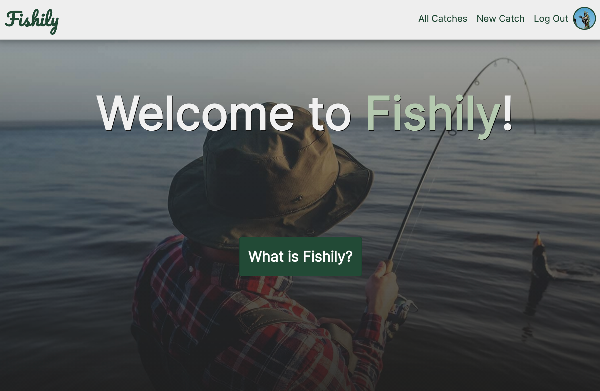
### What is fishily? 
Fishily is an app built in the MERN stack (MongoDB, Express, React, Node). Made for local fishermen/women to find and share their favorite fishing spots! 

Upon landing on the "home" page, users will be met with a short introduction into what the app's purpose is. There will be a button prompting them to sign in if they don't have an account.
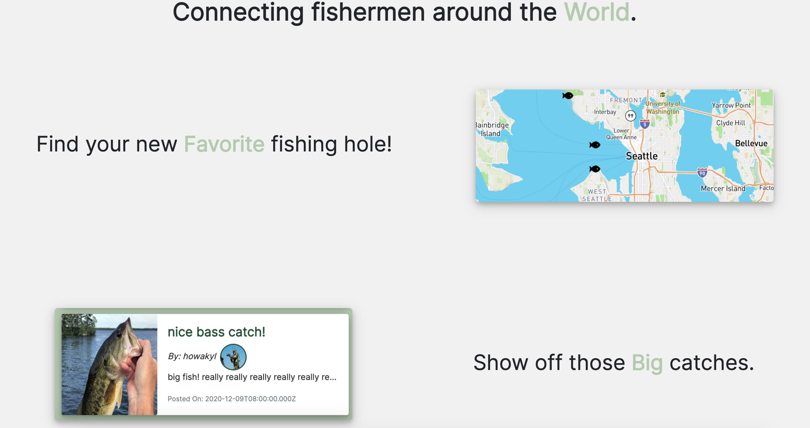 

 * If they are logged in, this will redirect them to the "index" page, which will show a google map showing fishing spot pins.

 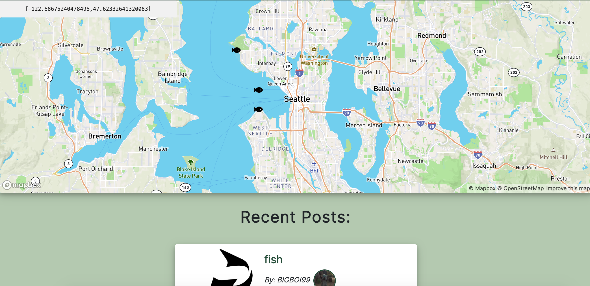

 * Users can view their profile, and make changes to their info as well, such as their profile picture, and their "bio".

 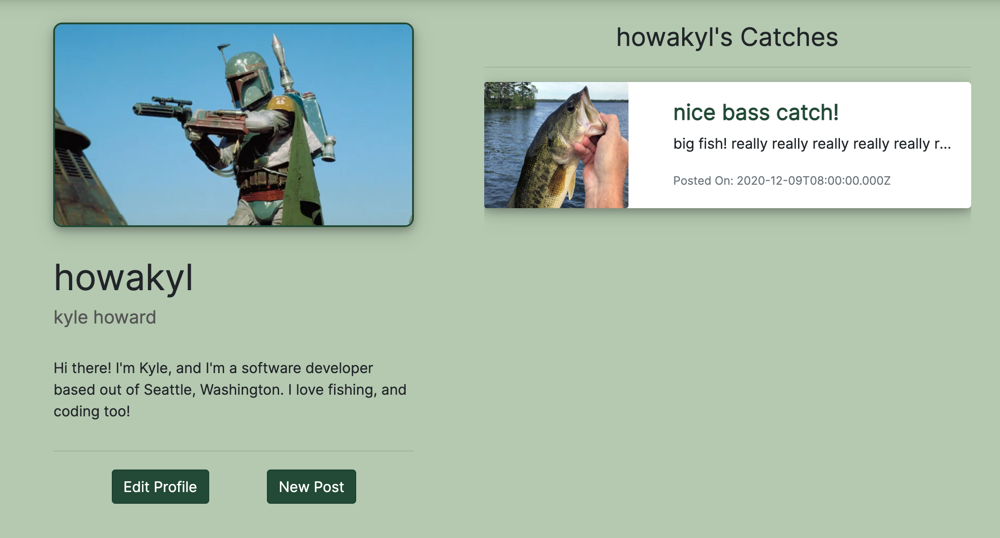

On Fishily, users can: 
* create an account, with their username, name, and password.
* The Primary purpose of the app is for users to create posts.
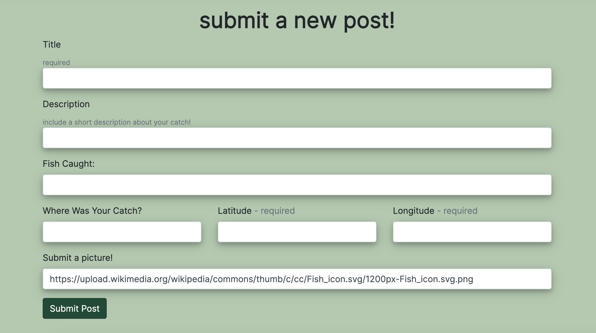
    * posts will have titles, descriptions, the fish caught, location, and optionally an image,and date/time.
    * When creating a post, users can set coordinates in a form, to create a pin on a map (using MapBox API) to show others (roughly) where they caught their delicious fish!
    * STRETCH GOAL: Users will also be able to leave comments on other users posts.
    * Users will have full CRUD capability on their posts.

* (FUTURE FEATURE) : users will also be able to look at our fish database, to search up any info on a fish they're interested in looking for. 
    * this database will have a fishes' name, genus, species, a short bio, and an image!

*  (FUTURE FEATURE) : Fishily will connect to the fishbase API, an external API that contains thousands of records of detailed fish info.

### Technologies Used: 
* React | Express | MongoDB | Node.js | axios | Javascript(ES6) | CSS3 | MapBox | Bootstrap | JSX | 

### Wireframes

* Landing page
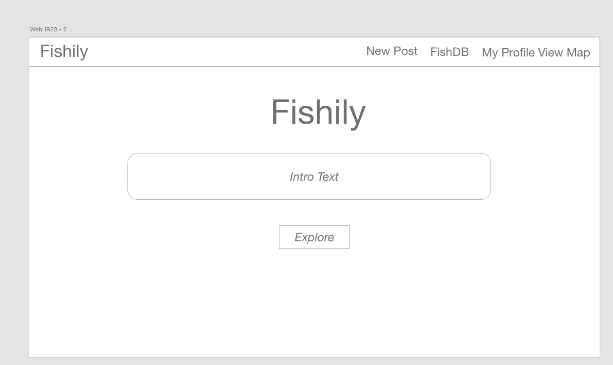

* profile page
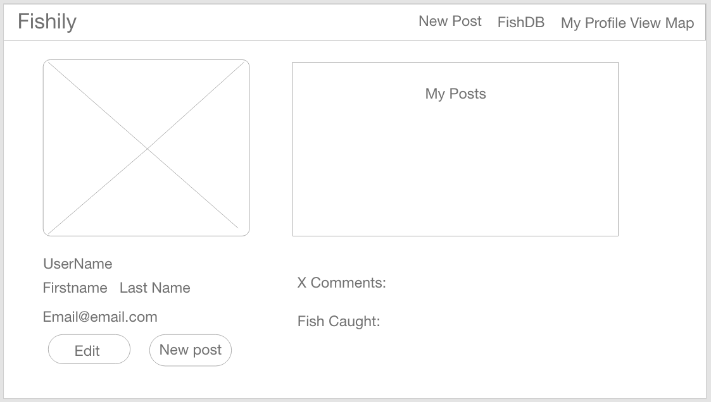

* Landing page pt 2
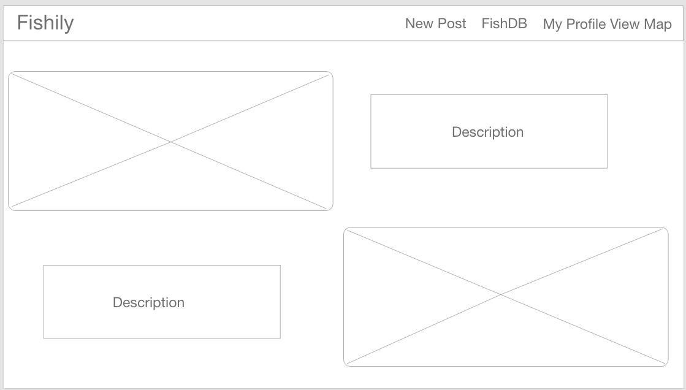

* post index
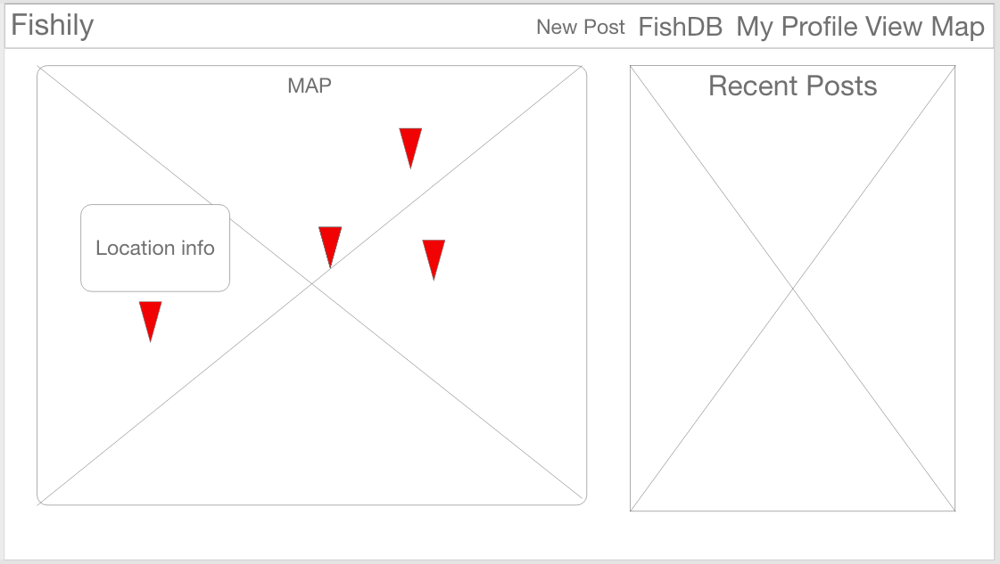

* post details
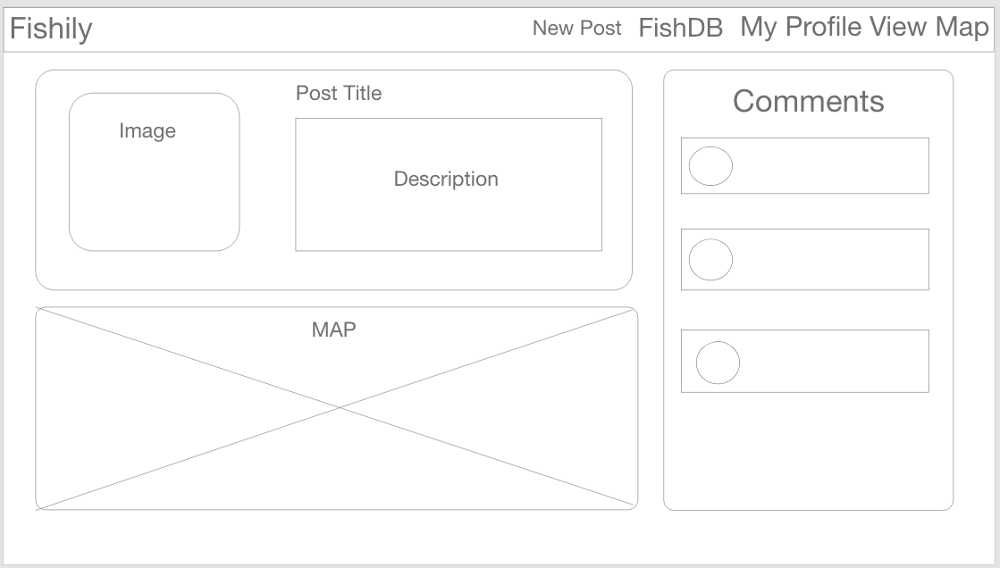

* ERD
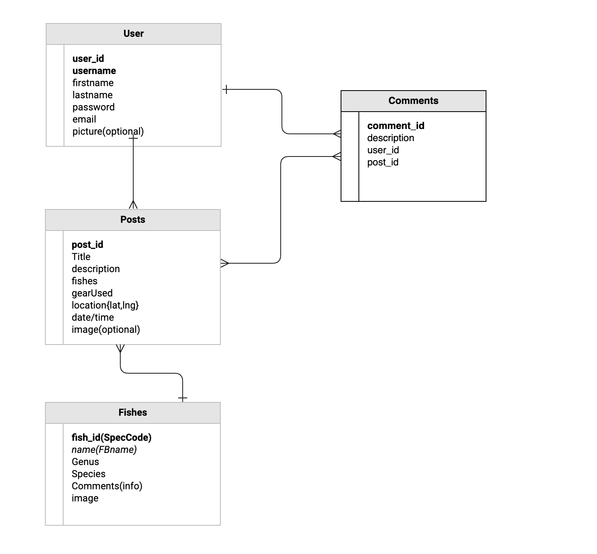

